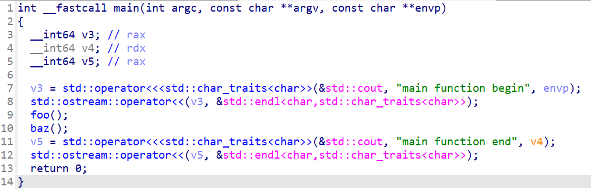
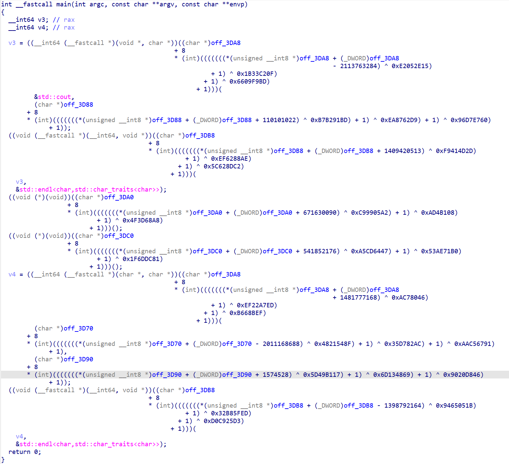

# Global Value Hide Pass

An LLVM pass plugin developed based on LLVM, designed to obfuscate global values (including global variables and function calls, collectively referred to as global variables) in programs by transforming call instructions into complex expressions.

# Obfuscation Expressions

The obfuscation process consists of two parts:

1. First Part: Create an indirect global variable V for the original global variable S, where `V = S + random_offset`. The original calls to S are modified to (V - random_offset). Since V is determined at compile-time, it appears as a random value during reverse engineering.

2. Second Part: Algebraically substitute the subtraction operation from the first part with a complex expression. The complex expression can be extended customarily. The current implementation provides one example: `constA - ((-(key + constA)) + ((key + constA) ^ constB) + constC) ^ constD`.

# Customizing Obfuscation Expressions

To customize the obfuscation expression, only modify the second part of the substitution logic. Edit the replacement code in the pass/algebraic_substitution directory.

## 效果

Before obfuscation: as shown in所示

After obfuscation: as shown in所示

## 依赖

Requires LLVM 19 and CMake to be installed.

## 编译

This project is developed for LLVM 19. For other LLVM versions, modify the LLVM and Clang++ versions in the root directory's CMakeLists.txt.

```
cmake -B build -S .
cmake --build build
```